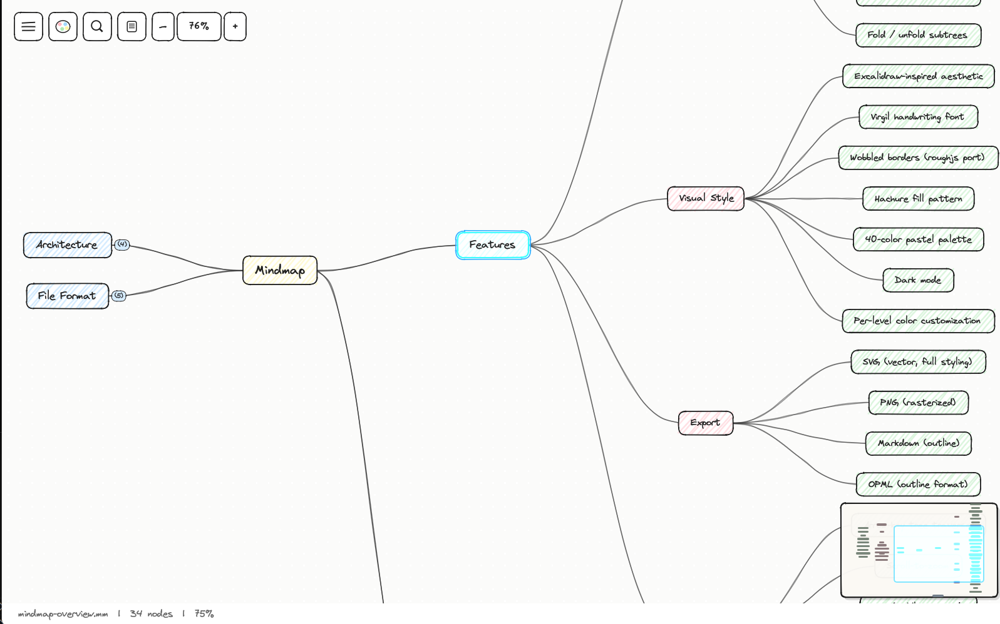

# Mindmap

A hand-drawn mind mapping tool for FreeMind `.mm` files, built with Rust and egui.



---

## Features

**Visual**
- Excalidraw-inspired aesthetic — Virgil handwriting font, wobbled borders, hachure fill
- 40-color pastel palette, depth-based coloring with per-level customization
- Dark mode, minimap, canvas grid

**Editing**
- Add/delete/reparent nodes; full subtree cut/copy/paste
- Inline text editing — tap any key on a selected node to start typing (Excel-style)
- Per-node notes and hyperlinks
- Fold/unfold subtrees; fold-all / unfold-all
- Full undo/redo history

**Navigation**
- Keyboard-driven tree traversal (arrow keys)
- Scroll-to-zoom, middle-mouse / Space+drag to pan, Ctrl+0 to fit
- Search & replace (Ctrl+F)
- Multi-select (Ctrl+Click)

**I/O & Export**
- Reads and writes FreeMind `.mm` XML — round-trip safe
- Export to SVG, PNG, Markdown, OPML

---

## Getting Started

**Prerequisites:** Rust toolchain ([rustup.rs](https://rustup.rs))

**Linux (Ubuntu/Debian):** Install system dependencies first:
```bash
sudo apt-get install libxcb-render0-dev libxcb-shape0-dev libxcb-xfixes0-dev libxkbcommon-dev libgtk-3-dev
```

```bash
git clone https://github.com/asulik1988/mindmap.git
cd mindmap
cargo build --release
```

**Run:**
```bash
# Open a file directly
./target/release/mindmap path/to/file.mm

# Start with an empty map
./target/release/mindmap
```

On Windows:
```powershell
.\target\release\mindmap.exe path\to\file.mm
```

**macOS note:** The DMG release is not code-signed. On first launch, macOS will block it. To open it:
1. Click "Done" on the dialog that says the app can't be verified
2. Go to **System Settings → Privacy & Security**
3. Scroll down to find "Mindmap was blocked to protect your Mac" and click **Open Anyway**

---

## Keyboard Shortcuts

### Navigation
| Key | Action |
|-----|--------|
| `←` `→` `↑` `↓` | Move between nodes |
| `Home` | Jump to root |
| `Ctrl+F` | Search & replace |
| `Ctrl+0` | Fit map to window |
| `?` | Show help overlay |

### Editing
| Key | Action |
|-----|--------|
| `Tab` | Add child node |
| `Enter` | Add sibling below |
| `Shift+Enter` | Add sibling above |
| `F2` / Double-click | Edit selected node |
| *Any printable key* | Edit node (replaces text) |
| `Delete` / `Backspace` | Delete node |
| `Ctrl+B` | Toggle bold |
| `Ctrl+.` | Toggle fold |
| `Ctrl+Shift+−` / `Ctrl+Shift+=` | Fold all / Unfold all |
| `Ctrl+Z` / `Ctrl+Shift+Z` | Undo / Redo |
| `Ctrl+C` / `Ctrl+X` / `Ctrl+V` | Copy / Cut / Paste subtree |

### View & File
| Key | Action |
|-----|--------|
| `Ctrl+S` | Save |
| `Ctrl+Shift+S` | Save As |
| `Ctrl+O` | Open file |
| `Ctrl+N` | New map |
| `Ctrl+Shift+N` | Notes panel |

---

## Mouse & Drag

- **Click** — select node; click again on folded node to expand
- **Ctrl+Click** — multi-select
- **Double-click** — enter edit mode
- **Right-click** — context menu (add, edit, cut, copy, paste, colors, links, fold)
- **Drag node** — reparent (cycles prevented automatically; ghost preview while dragging)
- **Middle-drag** or **Space+drag** — pan canvas
- **Scroll wheel** — zoom toward cursor

---

## File Format

Reads and writes FreeMind `.mm` XML. Preserved attributes:

| Attribute | Meaning |
|-----------|---------|
| `TEXT` | Node label |
| `COLOR` / `BACKGROUND_COLOR` | Text and fill colors |
| `POSITION` | Branch side (left/right) |
| `FOLDED` | Fold state |
| `LINK` | Hyperlink URL |
| `<font>` | Bold, name, size |
| `<richcontent>` | HTML notes |
| `CREATED` / `MODIFIED` | Timestamps |

---

## Export

| Format | Description |
|--------|-------------|
| **SVG** | Vector output — full styling, Virgil font, Bezier edges |
| **PNG** | Rasterized via resvg |
| **Markdown** | Heading hierarchy + bullet points; notes as blockquotes |
| **OPML** | XML outline format compatible with most outline editors |

File → Export → choose format.

---

## Visual Design

The rendering style is a faithful port of [rough.js](https://roughjs.com) into Rust: each node border is drawn with randomized wobble (roughness 0.5, bowing 0.5), filled with a hachure pattern at −41° with jittered gaps. The color palette is 40 pastel tones drawn from 8 hue families, cycling by tree depth. Fonts are loaded from `src/assets/` — Virgil for body text, Caveat as fallback.

---

## Architecture

```
src/
├── app.rs                  # eframe App, top-level update loop
├── model/                  # Arena-based node tree, NodeId = usize
├── layout/
│   └── reingold_tilford.rs # Bidirectional Reingold-Tilford layout
├── canvas/                 # Viewport, renderer, edge + node drawing
├── style/
│   ├── wobble.rs           # roughjs port (wobbled borders, hachure fill)
│   └── colors.rs           # 40-color depth palette
├── interaction/            # Input handling, editing, search
├── history/                # Undo/redo action stack
├── io/                     # FreeMind .mm read/write (quick-xml + serde)
├── export/                 # SVG, PNG, Markdown, OPML exporters
└── ui/                     # Panels: notes, search, help overlay, context menu
```

**Key dependencies:** `egui` / `eframe` (GUI), `quick-xml` + `serde` (XML I/O), `rfd` (native file dialogs), `resvg` (PNG export).

---

## Acknowledgements

- **[FreeMind](https://freemind.sourceforge.net)** — the `.mm` XML format was created by the FreeMind project (open source since 2000). Files are compatible with FreeMind, [Freeplane](https://www.freeplane.org), and any tool that supports the format.
- **[rough.js](https://github.com/rough-stuff/rough)** (MIT) — the wobbled border and hachure fill algorithms in `src/style/wobble.rs` are a Rust port of rough.js by Preet Shihn.
- **[Excalidraw](https://github.com/excalidraw/excalidraw)** (MIT) — visual design inspiration; color palette and hachure fill approach were informed by Excalidraw's implementation.

See [THIRD_PARTY_NOTICES](THIRD_PARTY_NOTICES) for full license texts.
